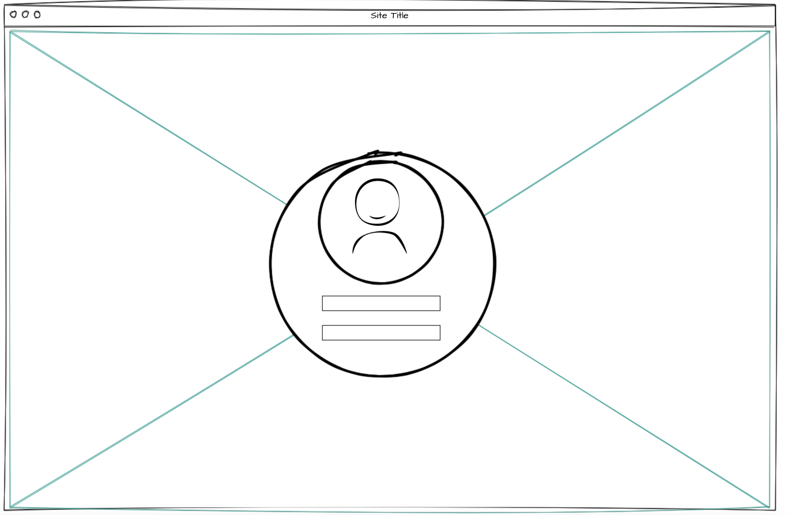
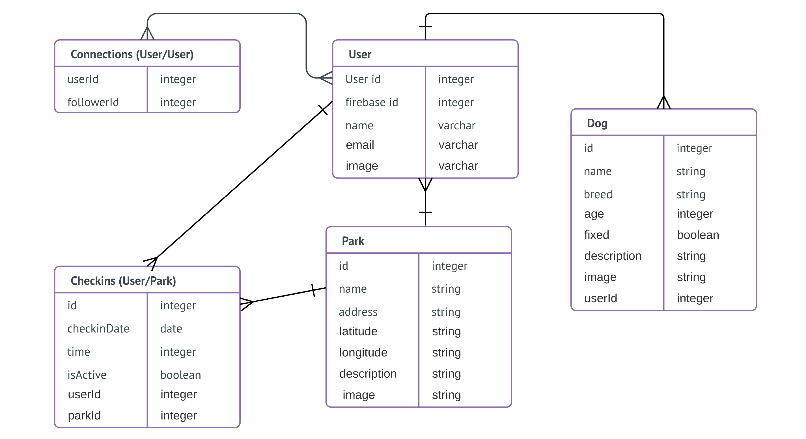

# Dog Check-In

Dog Check-In is a user-friendly social media site that connects dog owners and allows them to find dog-parks and other users within their local community. Dog Check-In is perfect for new residents looking to find new places to take their dogs, as well as established community members looking to connect with others and create a fun and safe environment for their pets to socialize. Join Dog Check-In today and get out and connect!


## Wireframes

### Log In:


### Map-Page: 


## Development Process

### Database ERD


## User Survey

The results of our user survey can be found [here](https://docs.google.com/spreadsheets/d/1RG9r9RBnV0dC8fGmJCs-H_Xowu9B6gJJjAQNRl28meI/edit#gid=1185723176).  We approached our survey to find out why people take their dogs to dog parks, what activities people like to do with their dogs and if they felt their dogs were friendly and enjoyed playing with other dogs. 

Here is a list of the intitial questions:

```
What type of activities do you enjoy doing with your dog?

How well does your dog socialize with other dogs?

How involved is your dog in your social media presence?

How does your dog influence your daily schedule?

What influences your decision to take your dog to a dog park?

Is social interaction important when going to a dog park?

Provide a brief description of your dog and its personality.


```


## Getting Started

These instructions will get you a copy of the project up and running on your local machine for development and testing purposes. See deployment for notes on how to deploy the project on a live system.

### Get the code

Either clone this repository or fork it on Guthub and clone your fork.

https://github.com/CRCastells/dog-check-in.git

cd dog-check-in


### Server Install

Our backend application server is a NodeJS application that relies upon some 3rd Party npm packages. You need to install these:

```
cd back-end
npm install
cd ..

```

### Client App

Our front end application is running Angular5 along with several other dependencies.  You need to install these.

```
cd front-end
npm install
cd ..

```

## Deployment Requirements

### PostgreSQL Database

You need to have PostgreSQL installed on your machine.
You will also need to create a database.
Update your .env file to include your local database connection path.  Otherwise you can update the database url directly in the index.js file located on the back-end/models directory.

### Firebase

Create a Firebase app. Visit firebase.google.com and click Sign In. Then click Go to Console.
Click Add A Project.
Once you're in your dashboard, click Add Firebase to your web app and copy the configuration settings.
Paste this into the environments.ts file 

### Google Maps

Create a Google Maps API Key by going to https://developers.google.com/maps/ and generating a new key.
Add this key to the .env file.

## Built With

* [Angular 2+](https://angular.io/) 
* [Nodejs](https://nodejs.org/en/) 
* [Sequelize](http://docs.sequelizejs.com/)
* [PostgrSQL Database](https://www.postgresql.org/docs/)
* [Firebase Google Authentication](https://firebase.google.com/)
* [Google Maps API](https://developers.google.com/maps/)

## Developed by:

* **Jared Pleva** 
* **Cameron Castells** 
* **Jeffrey Engleberg** 
* **Quinn O'Neill** 


